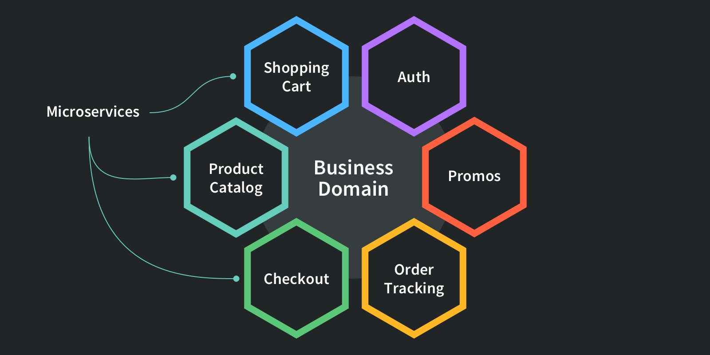
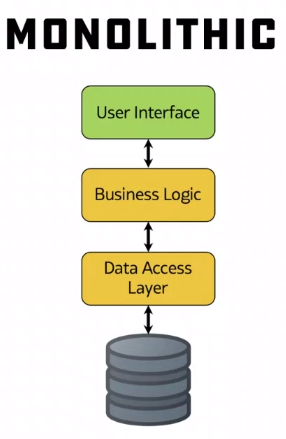

# Microservices Architecture

Microservices architecture is a design pattern for developing applications. Instead of building an application as a whole, monolithic unit, it's divided into a collection of loosely coupled, small, modular services. Each of these services, or "microservices," runs a unique process and communicates with the others through a well-defined, lightweight mechanism (such as HTTP/REST with JSON).

Here are some key characteristics of a microservices architecture:

1. Single Responsibility: Each microservice has a single responsibility and implements a single business capability.

2. Independence: Microservices can be deployed, upgraded, scaled, and restarted independently of other services in the application.

3. Decentralized: All services are decentralized and can be developed and maintained by different teams using different programming languages.

4. Data Isolation: Each service manages its own database, ensuring that the data is reliable and consistent within that service.

5. Automated Deployment: Microservices support continuous integration, continuous delivery, and automated deployment, which makes it easier to manage and deploy changes.

# Use Cases for Microservices Architecture:

1. Large and Complex Applications: For large and complex applications that need to be highly resilient, scalable, and manageable, microservices provide a robust solution.

2. Scalability: When different parts of an application have distinct scaling requirements, using microservices allows each component to be scaled independently, which can be more cost-effective and efficient.

3. Frequent Updates & Deployments: Companies that need to frequently update or add new features to their applications can benefit from the independent deployability of microservices.

4. Different Technology Stacks: If different parts of an application would benefit from being written in different programming languages or using different databases, the decoupled nature of microservices is advantageous.

5. Microservices & DevOps: Microservices fit well with DevOps practices such as CI/CD pipelines, containerization (like Docker), and orchestration platforms (like Kubernetes).

# Who is using it?

Several leading companies across various industries have adopted a microservices architecture to enhance their ability to design, scale, and improve their applications. Here are a few notable examples:

- Netflix: Netflix is one of the pioneers of microservices architecture. They migrated from a monolithic architecture to microservices to handle their growing scale of operations. Each microservice is responsible for a single process and communicates with other services via an API.

- Amazon: Amazon transitioned to a microservices architecture to support its transformation from an online marketplace to a cloud platform. Microservices have enabled them to scale and modify their services quickly, allowing for faster deployments.

- Uber: Uber's complex system demands quick scaling and high availability. With microservices, they've been able to scale their operations rapidly across different cities and countries.

- Spotify: Spotify uses microservices to ensure a seamless music streaming experience for its users. By adopting this architecture, they've been able to allow independent teams to work on distinct features and services.

- eBay: eBay moved from a monolithic architecture to a microservices-based one to support its ever-expanding user base and product catalog. This transition helped eBay scale efficiently and maintain system stability.

- Twitter: To handle a massive amount of requests per second, Twitter switched to a microservices architecture. This change helped them to cope with their rapid growth and the huge volumes of tweets, likes, and shares happening every second.

These companies illustrate the advantages that microservices can offer, especially in terms of scalability, adaptability, and the capacity to handle complex systems. However, implementing microservices requires careful planning and management to address challenges such as data consistency, service communication, and fault tolerance.

# Why should we use it?

While the decision to use microservices should depend on the specific requirements of your project, there are several compelling reasons to consider this architecture style:

Scalability: Microservices can be independently scaled based on the needs of specific services of an application. If one service requires more resources, it can be scaled without affecting others. This can lead to more efficient resource usage.

Resilience: If a microservice fails, it can be isolated and resolved without affecting the functioning of the rest of the application. This makes the system more resilient to failures compared to monolithic architectures where a single failure could potentially bring down the entire system.

Speed of Deployment and Updates: As each microservice can be developed, tested, and deployed independently, updates or new feature releases can be done more rapidly and frequently without disrupting the entire application.

Technological Freedom: Each microservice can be built using the most appropriate technology stack for its purpose, rather than being constrained by the technology choices of the entire application. This can allow for more optimal design and performance for each service.

Easier Maintenance and Understanding: As each service is smaller and has a specific function, it is easier to understand, maintain, and update. Teams can work independently on different services, speeding up the development process.

Optimized for DevOps and CI/CD: Microservices are ideal for Continuous Integration/Continuous Deployment (CI/CD) practices and DevOps culture. They work well with containerization technologies like Docker and orchestration tools like Kubernetes.

However, while there are many advantages, there are also challenges to consider, such as the complexity of managing multiple services, data consistency across services, and network latency. It's important to carefully consider the needs and capacity of your organization before transitioning to a microservices architecture.

# When Not to use it?

While microservices offer many benefits, they are not always the best choice for every project. Here are some scenarios when it might be better to consider other architectural styles:

1. Small Applications: If the application you're building is small and unlikely to grow much in complexity or scale, a microservices architecture might be overkill. A simpler monolithic architecture could be more appropriate and efficient in such cases.

2. Startup or Early Stage Projects: If you're still in the process of validating your business idea or if major changes are expected in the early stages, a monolithic architecture can be easier to manage and modify.

3. Limited Resources: Implementing and managing microservices requires significant operational overhead. It requires managing multiple databases, implementing inter-service communication, handling distributed system failures, etc. If your team doesn't have the necessary resources or expertise, it might be better to start with a simpler architecture.

4. Complexity of Distributed Systems: Microservices essentially form a distributed system, which inherently comes with complexity. This includes network latency, message formats, load balancing, data consistency, and fault tolerance. If these complexities cannot be efficiently managed, it might be better to opt for a different architecture.

5. Rapid Prototyping: If your primary goal is to develop a prototype as quickly as possible to gather feedback, the overhead of setting up microservices might slow you down. A monolithic architecture can allow you to develop and iterate faster in the early stages.

Remember, choosing the right architecture depends on your specific project requirements, team capabilities, time constraints, and long-term goals. It's often a good idea to start simple and consider moving to more complex architectures like microservices as the need arises.

# Compared to monolith and 2 tier architectures

These terms - Microservices Architecture, Monolithic Architecture, and Two-Tier Architecture - refer to different approaches for structuring and deploying applications.

1. Monolithic Architecture

In a monolithic architecture, all the application's components (user interface, server-side application, and database) are bundled together and run as a single service. This means that if you need to update or scale any component, you need to rebuild and deploy the entire application.

Pros: Simpler to develop, test, and deploy initially.

Cons: Application components are tightly coupled and not independently scalable. Maintenance and updates can become complex as the application grows.

2. Two-Tier Architecture

A two-tier architecture, often referred to as client-server architecture, divides an application into two parts: a client-side user interface and a server. The server-side usually contains both the application logic (business logic) and the database management functions.

Pros: The separation of concerns makes the system more manageable. It allows the client and server to be developed and scaled independently.

Cons: This model can become inefficient as the user base and data volume grow, due to network performance and data management issues.

3. Microservices Architecture

Microservices architecture takes the concept of separation of concerns to the next level. An application is built as a collection of small, independent, and loosely coupled services. Each service is responsible for a single business capability, runs its own process, and communicates with other services via APIs.

Pros: Services can be developed, deployed, and scaled independently. This architecture supports continuous deployment and scalability. It also enables teams to use the best technology stack for each service.

Cons: Managing microservices can be complex, requiring careful coordination and management of inter-service communication, data consistency, and distributed system failures.

In summary, the choice between these architectures depends on your project's requirements, such as its size, complexity, expected user base, and the resources available for development and management.

# What is docker and use cases : 

Docker is an open-source platform that automates the deployment, scaling, and management of applications. Docker achieves this through the use of containerization, which encapsulates an application with its dependencies into a self-contained unit, called a container, that can run anywhere.

In essence, Docker provides a way to run applications securely isolated in a container, packaged with all its dependencies and libraries. It also provides a Dockerfile to automate the building of container images and Docker Compose to define multi-container applications.

Here are some common use cases for Docker:

1. Simplified Configuration: Docker lets you put your environment and configuration into code, reducing the variability between the development and production environments. This makes setting up software and applications easier and faster.

2. Code Pipeline Management: Docker can streamline the development lifecycle by creating a unified environment from development to production. This consistency makes it easier to identify and fix issues early in the development process.

3. App Isolation: Docker’s containerized architecture gives each application its own environment, reducing conflicts between different application dependencies and versions.

4. Rapid Deployment: Docker containers are lightweight and start quickly. This makes them a good fit for deploying, scaling, and descaling applications on the fly.

5. Continuous Integration/Continuous Deployment (CI/CD): Docker is commonly used in CI/CD pipelines. Developers can define application build processes, test, and deploy them into various environments.

6. Microservices: Docker is a popular choice for microservices architectures because it allows each service to run in its own containerized environment.

7. Debugging Capabilities: Docker has tools that allow for efficient error identification and troubleshooting.

Remember, while Docker offers many benefits, it may not always be the best tool depending on the context. Factors such as project requirements, infrastructure, and resources should be considered when deciding to use Docker or another similar tool.

# Difference between virtualisation and containerisation

Both virtualization and containerization are methods of abstracting resources to run applications, but they function differently and serve different purposes:

Virtualization

Virtualization is a technology that allows you to create multiple simulated environments or dedicated resources from a single, physical hardware system. In the context of servers, it enables you to run multiple different virtual machines (VMs) on a single physical server. Each VM includes a full copy of an operating system, one or more apps, necessary binaries, and libraries - taking up tens of GBs. VMs are also slow to boot.

Pros: Offers a high level of isolation, as each VM runs its own OS; this makes VMs very secure.

Cons: It's resource-intensive, as each VM requires a full OS to run. Less efficient than containerization due to the overhead of running full OS instances.

Containerization

Containerization is a lightweight alternative to full machine virtualization that involves encapsulating an application in a container with its own operating environment. This provides many of the benefits of load isolation and security but is more streamlined and efficient. Containers share the host system’s OS kernel and do not require an OS per application, driving higher server efficiencies and reducing server and licensing costs.

Pros: Lighter and more resource-efficient than VMs; containers are portable across platforms and can start almost instantly. Allows for high levels of abstraction and isolation while using fewer resources than traditional VMs.

Cons: While containers are isolated from each other, they share the same OS and kernel, making them less isolated than VMs. This can lead to slightly lower security than VMs in certain scenarios.

In conclusion, the choice between virtualization and containerization depends on the specific use case, with considerations around efficiency, performance, security, and the specific needs of the application being run.

# Maintaining security with docker : 

1. Use Trusted Images:

Always use images from trusted sources or official images on Docker Hub. Verify the image publisher and consider the number of downloads and recent updates.

2. Keep Docker Updated:

Regularly update Docker to the latest version to benefit from security patches.

3. Limit Capabilities:

Use the principle of least privilege by disabling or removing unnecessary Docker capabilities.

4. Scan Images for Vulnerabilities:

Regularly scan Docker images for vulnerabilities using tools like Clair, Docker Bench, or even Docker's built-in security scanning.

5. Implement User Namespaces:

User namespaces isolate the Docker daemon and container processes, which prevents a container from gaining full root access to the host.

6. Secure Container Interfaces:

Secure container's system interfaces like seccomp, SELinux, AppArmor, etc.

7. Use Docker Secrets for Sensitive Information:

For handling sensitive data like passwords or API keys, use Docker secrets rather than environment variables.

8. Don't Run Docker Containers as Root:

Try to avoid running Docker containers as root to reduce potential damages if the container is compromised.

9. Implement Network Segmentation:

Use Docker networking capabilities to isolate container communication.

10. Regularly Review and Audit:

Regularly review Docker files, configurations, and deployments to ensure they follow best security practices.

Docker security is a vast topic, and these are just some of the best practices. For a thorough approach, consider integrating DevSecOps practices into your pipeline.

# Docker volumes 
Docker volumes are the preferred mechanism for persisting data generated by and used by Docker containers. Docker volumes are completely managed by the Docker process.

Docker volumes are important for two main reasons:

Data persistence: Docker containers are ephemeral, which means all the data produced inside a container is destroyed once the container is stopped. If you have a database running inside a Docker container and it writes data to the container's file system, all of the data will be lost when the container is stopped. Docker volumes solve this problem by allowing you to create a special directory on the host machine and then mount that directory into a container. Any data written to the volume directory inside the container will be stored on the host machine and will persist even if the container is destroyed.

Data sharing: Volumes can also be used to share data among containers. If multiple containers mount the same Docker volume, the data in the volume will be available to all the containers, allowing them to share files.

To use Docker volumes, you can use the -v or --mount flag in the docker run command. For example, to create a volume named my_volume and mount it to /data inside the container, you would use:

```bash
docker run -v my_volume:/data my_image
```
This command will start a container from my_image, and any data that the container writes to the /data directory inside the container will be stored in my_volume on the host machine. If my_volume does not already exist, Docker will automatically create it for you.

Volumes are superior to using bind mounts (another method of persisting data from containers), as they are easier to use, work on both Linux and Windows containers, and are safer for the host system since the host file system is not directly exposed to the container.