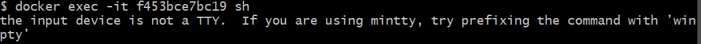

# Getting a profile page up on docker

>Prereqs : 
>1. Html file
>2. Docker account
>3. Docker installed,  `docker` in bash should give list of commands
>4. Login to your docker account in bash using `docker login`
# Steps:

1. Create a folder and a file within called `Dockerfile` with no extension. in the docker file populate with 
```docker
# Use an official nginx image as a parent image
FROM nginx:latest

# label it - with your name
LABEL MAINTAINER=BASIL

# Copy the HTML file from your local machine to the working directory in the image
COPY ./index.html /usr/share/nginx/html/index.html

# required port exposed 80 
EXPOSE 80

# launch the app
CMD ["nginx", "-g", "daemon off;"]
```
2. Build the Docker Image: Run the following command in your terminal:
```bash
docker build -t your-dockerhub-username/your-image-name:version . # . used if you are already in the dockerfile directory, otherwise specify path
```
3. Push the Image to Docker Hub: 
```bash
docker push your-dockerhub-username/your-image-name:version
```
4. You can check your docker hub, the image should be uploaded.

5. You can now access your profile from any pc using (80:80, the first is which port on your machine is directed to which port in the docker container, so no need for reverse proxies anymore can do something like 80:3000)
```bash
docker run -d -p 80:80 basilkh/profile:2
```
# Useful Docker commands

- view docker containers running with 
```bash
docker ps
```
- Force delete any by
```bash
docker rm ID -f
```

- shows your docker images
```
docker images
```

- To enter a certain docker shell run:

```bash
docker exec -it <ID> sh
```
if you receive error : 


then use :
```bash
alias docker="winpty docker"
```

- to stop a service without deleting it : 
```bash
docker stop <ID>
```
- to start it again 
```
docker start <ID>
```
- this will host docker docs on your local machine on port 4000 
```
docker run -d -p 4000:4000 docs/docker.github.io
```

- Can build without using cached files lets say you made changes to the github etc: 
```bash
docker build --no-cache -t basilkh/nodeapp .
```
# Launching sparta node app using docker 
1. Create a docker file and populate with : 
```docker
# Use an official Node.js runtime as the base image
FROM node:12

# label it - with your name
LABEL MAINTAINER=BASIL

# Set the working directory in the Docker container
WORKDIR /usr/src/app

# Clone your app from the repository
RUN git clone https://github.com/basil-kh/app.git .

# Install the application dependencies
RUN npm install

# Expose port 3000 for the application
EXPOSE 3000

# Define the command to run the application
CMD [ "node", "app.js" ]
```
2. Build :
```bash
docker build basilkh/nodeapp:1 /../../dockerfolder
```
3. Run :

```
docker run -d -p 3000:3000 basilkh/nodeapp:1
```
4. Can then push if you like
```
docker push basilkh/nodeapp:1
```

# Launching mongodb server in a docker container


 Populate docker file : 

 ```docker
FROM mongo:latest

# Change bindIp in mongod.conf.orig
RUN sed -i 's/bindIp: 127.0.0.1/bindIp: 0.0.0.0/g' /etc/mongod.conf.orig

# Use on port 27017
EXPOSE 27017
 ```

Build:
```
docker build -t basilkh/mongodb .
```

Run:
```bash
docker run -d -p 27017:27017 basilkh/mongodb
```

Push:
```bash
docker push basilkh/mongodb
```

Can later use:
```bash
docker run -d -p 27017:27017 basilkh/mongodb
```

# Using docker compose to link the app and db


make a file called `docker-compose.yml` and populate with :

```yaml
version: '1'
services:
  app:
    image: basilkh/nodeapp:2
    ports:
      - "3000:3000"
    depends_on:
      - mongodb
    environment:
      - DB_HOST=mongodb://mongodb:27017/posts

  mongodb:
    image: mongo:4.4
    ports:
      - "27017:27017"
```

Then launch using (can remove -d to see logs and not be detached)
```bash
docker-compose up -d
```

You can stop and remove all containers:
```bash
docker-compose down
```

If you want to stop the services but keep the containers, networks, and volumes, you can use the docker-compose stop command instead:

```bash
docker-compose stop
```

>note can do from outside the directory by replace docker-compose with your compose files path